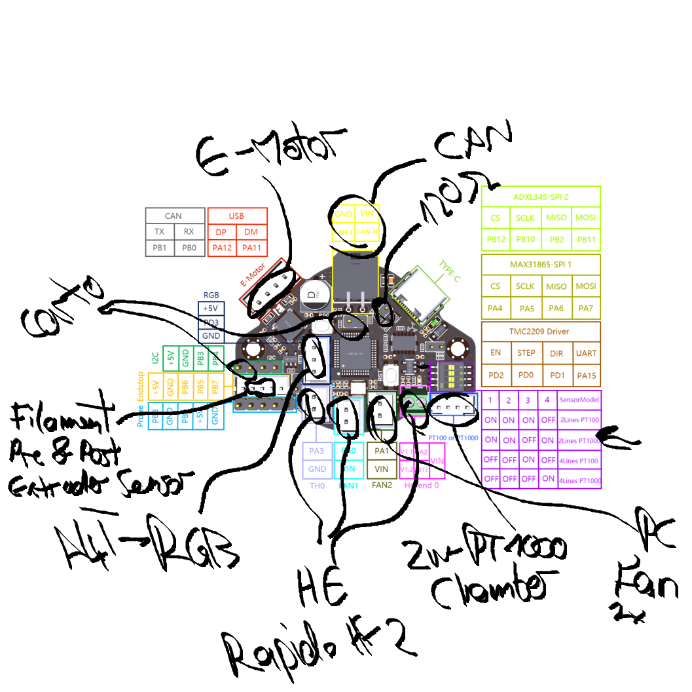

# VT.2112 - 300x300x250 Voron Trident

Based on a [Formbot kit](https://www.formbot3d.com/products/voron-trident-r1-pro-corexy-3d-printer-kit-with-best-quality-parts?VariantsId=10505) with printed components from a kind PIF provider.

## 🛠️ Hardware setup

### 🔩 Structural

* [Annex Panel Clips](https://github.com/Annex-Engineering/Annex-Engineering_User_Mods/tree/main/Printers/All_Printers/annex_dev-Panel_2020_Clips_and_Hinges) insted of the stock panel clips. Very useful mod to quickly open the panels. For extra style points the pins are printed in the primary color while the clips are printed in the accent color. Thanks to my PIF provider for this idea!
* Panels secured with 3mm foam tape.
* Additional M5x10x1 shims in all blind joints. I read about this tip on the Voron Discord.
* Screw torques: M3 0.35 Nm, M5 0.7 Nm, blind joints 1 Nm. Dito.
* Umbilical management with [PUG](https://www.printables.com/model/378567-pug-parametric-umbilical-gland/files)s and a [guide arm](https://www.printables.com/model/978123-voron-bowden-ptfe-tube-guide-arm-and-canbus-cable).
    * [PUG attachment for A drive](https://www.printables.com/model/469241-voron-trident-pug-parametric-umbilical-gland-attac)
    * [PUG mount for WWBMG/EBB36](https://www.printables.com/model/1158928-wwbmg-ebb36nh36-pug-mount)
* [Beefy Front Idlers](https://github.com/clee/VoronBFI) with [BFI Gears](https://github.com/Diyshift/3D-Printer/tree/main/BFI%20Gears) instead of the stock idlers.

### 🔥 Toolhead

* [XOL carriage](https://github.com/Armchair-Heavy-Industries/Xol-Toolhead)
* [A4T toolhead](https://github.com/Armchair-Heavy-Industries/A4T/)
* [WWBMG extruder](https://github.com/Armchair-Heavy-Industries/A4T/blob/main/STL/WW-BMG%20for%20A4T/README.md)
* [EBB36 toolboard](https://bttwiki.com/EBB%2036%20CAN.html)
* [Phaetus Rapido Hotend 2 HF](https://www.phaetus.com/products/rapido2) with a hardened steel nozzle and an 104NT thermistor.
* [Cartographer v3 with adxl345](https://cartographer3d.com/products/cartographer-probe-v3-with-adxl345-standard) for bed meshing and Z homing.
* [Nozzle brush](https://www.printables.com/model/1200625-voron-trident-nozzle-brush-and-park) using a silicone brush.
* PT1000 (2 wires) as chamber thermistor.
* Part cooling fans: 4010 blower fan: Gdstime GDB4010, Dual Ball Bearing, 24V
* Hotend fan: 2510 axial fan: Gdstime GDA2510 / Gdt2510S12B, Dual Ball Bearing, 24V

Wiring diagram for the toolhead: 

### ⚡ Electronics Bay

* [BIGTREETECH Manta M8P V2.0](https://bttwiki.com/M8P-V2_0.html) as mainboard, equipped with a [Raspberry Pi Compute Module 4](https://www.raspberrypi.com/products/compute-module-4/?variant=raspberry-pi-cm4001000).
* All stepper motor drivers are [BIGTREETECH TMC2209](https://bttwiki.com/TMC2209.html).
* Meanwell LRS-200 24V PSU
* Omron G3NB-210B-1 SSR for heated bed.
* Generic AC heater for heated bed with fuse @ 125 °C.
* Everything is organized (more or less) with [FT EMS](https://www.printables.com/model/647107-ft-ems-trident-300-electronics-management-system) and tons of cable ties.
* Motors
    * A/B: 2x [MOONS' MS17HD6P420I-04](docs/moons-MS17HD6P420I-04.png)
    * Z: 3x [MOONS' LE172S-T0804-300-CN-01-200](docs/moons-LE172S-T0804-300-CN-01-200.png)
    * Extruder: 1x [MOONS' CSE14HRA1L410A](docs/moons-CSE14HRA1L410A.png)

### 💨 Air quality

* [VEFACH](https://mods.vorondesign.com/details/aLS5rOxzGybD4FhVzCKNQ) to filter bad fumes. Filled with Nevermore Activated Charcoal and [this](https://www.amazon.de/dp/B07HHQKJ4G) HEPA filter. Attached is a generic fan from the Formbot kit.
* [Nevermore V5 Duo Micro](https://github.com/nevermore3d/Nevermore_Micro) to filter bad fumes. Filled with Nevermore Activated Charcoal and two generic fans from the Formbot kit.
* Two generic cooling fans in the electronics bay.

### ✨ Aesthetics

* Primary color: Black (Polymaker PolyLite ASA Black, PIF parts SUNLU ABS Black)
* Secondary color: Blue (Polymaker PolyLite ASA Blue, PIF parts SUNLU ABS Blue)
* Tertiary color: Teal (Polymaker PolyLite ASA Teal)
* Generic LED bar in the back.
* Generic 5" touch screen with an [appropriate mount](https://www.printables.com/model/926845-btt-hdmi5-v12-display-mount-voron).

### 🫘 Misc

* [Logitech C270](https://www.logitech.com/de-at/shop/p/c270-hd-webcam) with an [appropriate mount](https://mods.vorondesign.com/details/7KxcDXIBP1jjRc2ekU9w) in the front.

## 💡 Notable stuff

### Automatic power-off

In order to do an automatic power-off on shutdown (but not on reboot!) I plugged the printer into a smart plug controlled by Home Assistant. To turn on the printer I just turn on the smart plug (either manually via its physical button or via Home Assistant).

To manage power-off I have the following shell script and systemd unit file:

```sh
#!/bin/bash
set -euxo pipefail

if shutdown --show 2>&1 | grep '^Shutdown'; then
        curl -H "Authorization: Bearer XXXXXXXXXX" -H "Content-Type: application/json" -d '{"entity_id": "automation.turn_off_voron_trident"}' -m 1 http://homeassistant:8123/api/services/automation/trigger || true
fi
```

The if ensures that the automation is only triggered on a shutdown, not on a reboot. The Home Assistant automation with ID `automation.turn_off_voron_trident` waits for 10 seconds (this is important, because an immediate power-off would be too early) and then switches the smart plug off.

```ini
[Unit]
Description=Turns the power off
Requires=network-online.target
After=network-online.target

[Service]
Type=oneshot
RemainAfterExit=true
ExecStop=/home/michael/poweroff.sh

[Install]
WantedBy=multi-user.target
```

I saved the unit file in `/etc/systemd/system/turn-power-off.service` and then it can be enabled with `sudo systemctl enable turn-power-off.service`. If this command does not work right away you have to run `sudo systemctl deamon-reload` before. **Remember to change the path to the script!**

### Update script

There is an update script at `[docs/update.sh](docs/update.sh)`.

## 📋 TODO

* Either an MMU or toolchanger or both.
* Better camera (more FOV)
* I don't like the front door.
* StealthMax V2 and better bed fans.
